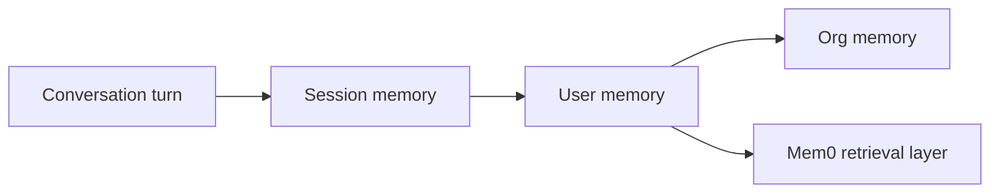

# Quickstart

> Get started with Mem0 Platform in minutes

Get started with Mem0 Platform's hosted API in under 5 minutes. This guide shows you how to authenticate and store your first memory.

## Prerequisites

* Mem0 Platform account ([Sign up here](https://app.mem0.ai))
* API key ([Get one from dashboard](https://app.mem0.ai/dashboard/settings?tab=api-keys\&subtab=configuration))
* Python 3.10+, Node.js 14+, or cURL

## Installation

<Steps>
  <Step title="Install SDK">
    <CodeGroup>
      ```bash pip theme={null}
      pip install mem0ai
      ```

      ```bash npm theme={null}
      npm install mem0ai
      ```
    </CodeGroup>
  </Step>

  <Step title="Set your API key">
    <CodeGroup>
      ```python Python theme={null}
      from mem0 import MemoryClient

      client = MemoryClient(api_key="your-api-key")
      ```

      ```javascript JavaScript theme={null}
      import MemoryClient from 'mem0ai';
      const client = new MemoryClient({ apiKey: 'your-api-key' });
      ```

      ```bash cURL theme={null}
      export MEM0_API_KEY="your-api-key"
      ```
    </CodeGroup>
  </Step>

  <Step title="Add a memory">
    <CodeGroup>
      ```python Python theme={null}
      messages = [
          {"role": "user", "content": "I'm a vegetarian and allergic to nuts."},
          {"role": "assistant", "content": "Got it! I'll remember your dietary preferences."}
      ]
      client.add(messages, user_id="user123")
      ```

      ```javascript JavaScript theme={null}
      const messages = [
          {"role": "user", "content": "I'm a vegetarian and allergic to nuts."},
          {"role": "assistant", "content": "Got it! I'll remember your dietary preferences."}
      ];
      await client.add(messages, { user_id: "user123" });
      ```

      ```bash cURL theme={null}
      curl -X POST https://api.mem0.ai/v1/memories/add \
        -H "Authorization: Token $MEM0_API_KEY" \
        -H "Content-Type: application/json" \
        -d '{
          "messages": [
            {"role": "user", "content": "Im a vegetarian and allergic to nuts."},
            {"role": "assistant", "content": "Got it! Ill remember your dietary preferences."}
          ],
          "user_id": "user123"
        }'
      ```
    </CodeGroup>
  </Step>

  <Step title="Search memories">
    <CodeGroup>
      ```python Python theme={null}
      results = client.search("What are my dietary restrictions?", filters={"user_id": "user123"})
      print(results)
      ```

      ```javascript JavaScript theme={null}
      const results = await client.search("What are my dietary restrictions?", { filters: { user_id: "user123" } });
      console.log(results);
      ```

      ```bash cURL theme={null}
      curl -X POST https://api.mem0.ai/v1/memories/search \
        -H "Authorization: Token $MEM0_API_KEY" \
        -H "Content-Type: application/json" \
        -d '{
          "query": "What are my dietary restrictions?",
          "filters": {"user_id": "user123"}
        }'
      ```
    </CodeGroup>

    **Output:**

    ```json  theme={null}
    {
      "results": [
        {
          "id": "14e1b28a-2014-40ad-ac42-69c9ef42193d",
          "memory": "Allergic to nuts",
          "user_id": "user123",
          "categories": ["health"],
          "created_at": "2025-10-22T04:40:22.864647-07:00",
          "score": 0.30
        }
      ]
    }
    ```
  </Step>
</Steps>

<Callout type="tip" icon="plug">
  **Pro Tip**: Want AI agents to manage their own memory automatically? Use <Link href="/platform/mem0-mcp">Mem0 MCP</Link> to let LLMs decide when to save, search, and update memories.
</Callout>

## What's Next?

<CardGroup cols={3}>
  <Card title="Memory Operations" icon="database" href="/core-concepts/memory-operations/add">
    Learn how to search, update, and delete memories with complete CRUD operations
  </Card>

  <Card title="Platform Features" icon="star" href="/platform/features/platform-overview">
    Explore advanced features like metadata filtering, graph memory, and webhooks
  </Card>

  <Card title="API Reference" icon="code" href="/api-reference/memory/add-memories">
    See complete API documentation and integration examples
  </Card>
</CardGroup>

## Additional Resources

* **[Platform vs OSS](/platform/platform-vs-oss)** - Understand the differences between Platform and Open Source
* **[Troubleshooting](/platform/faqs)** - Common issues and solutions
* **[Integration Examples](/cookbooks/companions/quickstart-demo)** - See Mem0 in action


---


# Memory Types

> See how Mem0 layers conversation, session, and user memories to keep agents contextual.

# How Mem0 Organizes Memory

Mem0 separates memory into layers so agents remember the right detail at the right time. Think of it like a notebook: a sticky note for the current task, a daily journal for the session, and an archive for everything a user has shared.

<Info>
  **Why it matters**

  * Keeps conversations coherent without repeating instructions.
  * Lets agents personalize responses based on long-term preferences.
  * Avoids over-fetching data by scoping memory to the correct layer.
</Info>

## Key terms

* **Conversation memory** – In-flight messages inside a single turn (what was just said).
* **Session memory** – Short-lived facts that apply for the current task or channel.
* **User memory** – Long-lived knowledge tied to a person, account, or workspace.
* **Organizational memory** – Shared context available to multiple agents or teams.



## Short-term vs long-term memory

Short-term memory keeps the current conversation coherent. It includes:

* **Conversation history** – recent turns in order so the agent remembers what was just said.
* **Working memory** – temporary state such as tool outputs or intermediate calculations.
* **Attention context** – the immediate focus of the assistant, similar to what a person holds in mind mid-sentence.

Long-term memory preserves knowledge across sessions. It captures:

* **Factual memory** – user preferences, account details, and domain facts.
* **Episodic memory** – summaries of past interactions or completed tasks.
* **Semantic memory** – relationships between concepts so agents can reason about them later.

Mem0 maps these classic categories onto its layered storage so you can decide what should fade quickly versus what should last for months.

## How does it work?

Mem0 stores each layer separately and merges them when you query:

1. **Capture** – Messages enter the conversation layer while the turn is active.
2. **Promote** – Relevant details persist to session or user memory based on your `user_id`, `session_id`, and metadata.
3. **Retrieve** – The search pipeline pulls from all layers, ranking user memories first, then session notes, then raw history.

```python  theme={null}
import os

from mem0 import Memory

memory = Memory(api_key=os.environ["MEM0_API_KEY"])

# Sticky note: conversation memory
memory.add(
    ["I'm Alex and I prefer boutique hotels."],
    user_id="alex",
    session_id="trip-planning-2025",
)

# Later in the session, pull long-term + session context
results = memory.search(
    "Any hotel preferences?",
    user_id="alex",
    session_id="trip-planning-2025",
)
```

<Tip>
  Use `session_id` when you want short-term context to expire automatically; rely on `user_id` for lasting personalization.
</Tip>

## When should you use each layer?

* **Conversation memory** – Tool calls or chain-of-thought that only matter within the current turn.
* **Session memory** – Multi-step tasks (onboarding flows, debugging sessions) that should reset once complete.
* **User memory** – Personal preferences, account state, or compliance details that must persist across interactions.
* **Organizational memory** – Shared FAQs, product catalogs, or policies that every agent should recall.

## How it compares

| Layer        | Lifetime            | Short or long term | Best for              | Trade-offs                   |
| ------------ | ------------------- | ------------------ | --------------------- | ---------------------------- |
| Conversation | Single response     | Short-term         | Tool execution detail | Lost after the turn finishes |
| Session      | Minutes to hours    | Short-term         | Multi-step flows      | Clear it manually when done  |
| User         | Weeks to forever    | Long-term          | Personalization       | Requires consent/governance  |
| Org          | Configured globally | Long-term          | Shared knowledge      | Needs owner to keep current  |

<Warning>
  Avoid storing secrets or unredacted PII in user or org memories—Mem0 is retrievable by design. Encrypt or hash sensitive values first.
</Warning>

